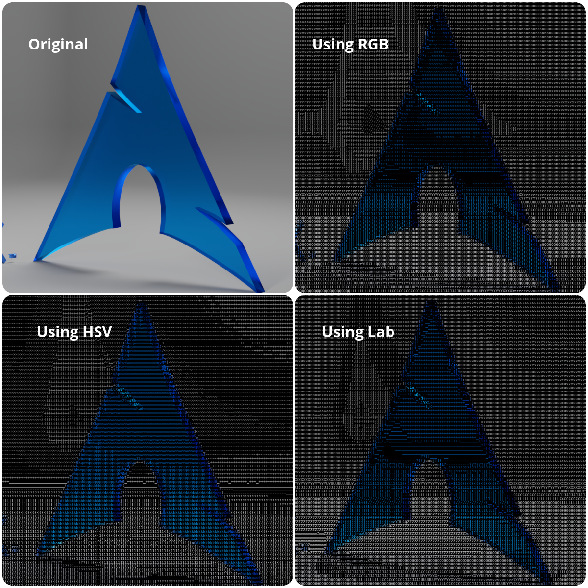
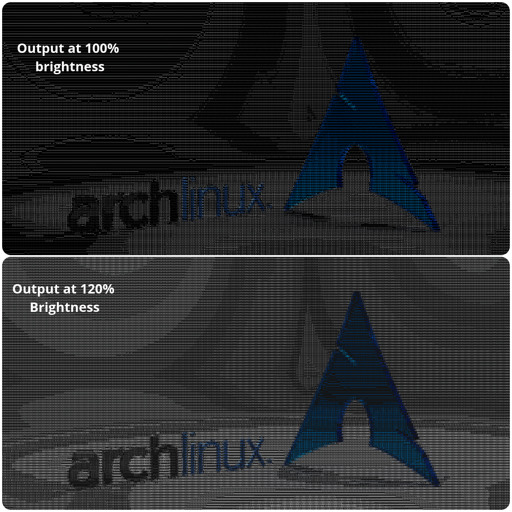

--------------------------------------------------------------------------------

# Videos To Ascii Art Generator

## Table of Contents: 
* Description
* How to Run The Project
* Demo and Results
* Internal Workings
* Things i Learned
* References

## Description
The final goal of this project is to convert an input video into an <a href = https://en.wikipedia.org/wiki/ASCII_art> ascii art </a> video. For this task, I used python and a couple of libraries.

## How to Run the Project
As mentioned earlier, this project is made using python, so we'll be needing it firstly (Developed using Python 3.10.5).
### Dependencies
|  Name  |     pip install Command     |
|:------:|:---------------------------:|
| Pillow |     `pip install Pillow`    |
| openCV | `pip install opencv-python` |
| ffmpeg | `pip install ffmpeg-python` |
|  Numpy |     `pip install numpy`     |

* After installing the necessary libraries, just clone the repo and open a terminal in the root directory of this repository.
* The program accepts arguments as `python ascii.py [FilePath, FileType, Resolution, FrameSkip, Background Color]` where :
* FileType = "-v" for video and "-i" for image.
* Resolution is the width of the output, height will be scaled accordingly. set it as -1 to keep same dimensions.
* FrameSkip is the amount of frames to skip in case selected FileType is video, set it randomly for image.
A value of 2 will half the output frame rate.
* Background is either "black" or "white"
* For example write `python Asciify.py "data/Videos/NootNoot2D.webm" -v 1280 2` to process the video file, at 1280x720 resolution (16:9), 15 fps (30/2) and black background (default option if no argument is given).
* Default arguments are `["data/Videos/Video_Sample.mp4", "-v", -1, 1, "black"]`
* Video processing especially will take a while, depending on the resolution of the video and number of frames, since optimization wasn't the priority yet. Images should render fairly quickly.
* Video outputs are stored in ./Ouputs directory, where folders are automatically created.\
Image Outputs are simply named as out.png in ./Outputs folder

## Demo and Results
### Demo

https://user-images.githubusercontent.com/101496881/174467930-4b5acf1b-5db0-4e71-8b72-7bc4a0dc6802.mp4

Sorry for the background noise.
### Results
These results are obtained after allowing the program to run for a significant amount of time, hence they are not obtained in real time.

https://user-images.githubusercontent.com/101496881/174437541-c6fc9890-94db-42d2-820f-b6ace8a5521f.mp4

https://user-images.githubusercontent.com/101496881/174440152-7b359239-3270-4ef7-b7b8-814aeae24761.mp4

https://user-images.githubusercontent.com/101496881/174454512-751057bc-5d40-4e9b-a51a-3290717977da.mp4

https://user-images.githubusercontent.com/101496881/174453509-941c505c-0164-4824-99be-d83cef513f2d.mp4

## Internal Workings
Let's see how this program works.\
This project can be broken down into two major subparts:
* Asciifying an Image
* Grabbing frames from a video and processing

### Task I - Asciifying an Image
Firstly what is an image? well, it's just a bunch of numeric data presented on 3D matrix having dimensions : <tt>Width x Height x Channels</tt>

The channels are Red, Green, and Blue in case of an RGB image, which defines how much red, green and blue values (range of 0 - 255) each pixel has respectively.
From these three Values, we can find the intensity of an image by taking their mean ((r+g+b)/3)

Now that we have the intensity of each pixel, we can go forward with mapping it with some ascii character. But we can't just proceed randomly, instead, we sort the ascii characters in the increasing order of their intensities. By this, i mean, characters that take up more area are more intense than those who take less.\
For Example : <tt> @ is more intense than _ </tt>.

The order that i used :\
<tt>.'\`^",:;Il!i<~+_-?[{1(|/tfjrxnuvczXYUJCLQ0OZmwqpdbkhao*#MW&8%B@$</tt>

We can map each intensity value from 0 - 255 to their corresponding ascii character using the formula : \
`position = int((intensity/255) * (len(char_list)))-1`

Since having ascii characters represented by white characters feels bland, i am also colorizing each character with the mean color of the pixel area they map to.

These give the image two major properties:
* Color allows difference to be visible
* Intensity allows the depth to be more apparent, making asciified images look sharper.

i am using true type fonts for this project, because their height and width are constant throughout the character set. This makes it easy and very algorithmic to calculate the mean intensity and color of a particular region of image, since the bounds are known before-hand.

Now, coming to the actual algorithm, it's fairly simple. We firstly divide the image into \
<tt>Image_Height/Font_Height Rows</tt>\
<tt>Image_Width/Font_Width Columns</tt>

We iterate to each of these newly formed cells, and then for the part of image lying in the currently iterating rectangle, we calculate the average intensity, and average color of all pixels in this cell using the aforementioned formulas.\
Now, we just insert the corresponding character in this cell after coloring it.

Repeat this process for all the cells, and we got ourselves an asciified version of the input image!

#### Python Specific Details
Since we are working with images here, i am using both PIL and openCV to do this task. Most of the operations are handled by openCV.\
PIL allows us to draw monospaced fonts on an image, which is something that is missing in openCV, hence justifying PIL's use here.\
The mean values are quickly calculated by slicing the input array and applying numpy's mean().\
Rest of the programming details can be found as comments in Asciify.py file.

Now that we have got ourselves an algorithm that converts an image to an ascii image, let's move to the next step.

### Task II - Asciifying a Video
This is the additional task that i am doing in this project.

This step mainly involves extracting frames from an input video, then applying the aforementioned algorithm to process each frame, then reproducing a video using these frames and audio from the original input.\
For this, i am making use of OpenCV and ffmpeg.

We iterate through all of the frames in the input video using the VideoCapture function of openCV library. As we are iterating, we process the frame currently being iterated and extract them as `frame_{idx}.png in ./Outputs/Video_Name/frames` folder.
Now, we have all of the processed frames saved as .png files in the Output directory having file names with a fixed pattern.

ffmpeg is now used to gather all of these frames, and merge them with the audio in the original file (if it is present), and produce the final output video, which is then exported to `./Outputs/Video_Name as Video_Name.extension`.\
Directory Structure:
<pre>.
└── Outputs
    ├── Video_Name_1
    │   ├── frames
    │   │   ├── frame_1.png
    │   │   ├── frame_2.png
    │   │   ├── frame_3.png
    │   │   └── ... (Numerically labelled frames stored here)
    │   └── Video_Name_1.mp4
    └── Video_Name_2
        ├── frames
        │   ├── frame_1.png
        │   ├── frame_2.png
        │   ├── frame_3.png
        │   └── ... (Numerically labelled frames stored here)
        └── Video_Name_2.webm</pre>
This concludes the algorithm.

### Extra Information
#### Intensity Calculation
The simplest way of calculating intensity is to just average out the RGB channels. But there are other ways as well such as average of min and max of these values, or simply using the L value in Lab image, or we can average out the SV channels in HSV image. More on that <a href=https://en.wikipedia.org/wiki/HSL_and_HSV#Lightness>here</a>\
For Comparison, when calculating intensity :\

As we can see, using Lab and RGB gives almost identical output, But using HSV gives brighter output. I have included all these intensity calculation code in the program as comments to suit the need for all situations.

#### Brightness of output
For Coloring, i am increasing the brightness of the final output by converting the output to HSV, then increasing the Value channel by 20 (~20% increase).

Which one's better is very subjective. I feel the results are great when using HSV for calculating intensity, and increasing brightness by 20%, so i went with that.

#### Background Color
The background of output images is by default set to black, but it could be changed of course. black background allows the ascii art to "pop out" in my opinion. White background of course looks better in a few situations.\
For Comparison, Original Image:\

Black Background:\

White Background:\

It's obvious how a white background makes the color look washed out in comparison with a black background.

#### Performance Analysis
Now, coming to optimization and performance analysis, converting high resolution images directly to ascii is a very performance heavy task, hence some corners needs to be cut since we are not working with one image, but rather hundreds, or even thousands in the form of video frames.\
For this reason, i decided to introduce two more variables, Resolution and Frame Skip. The former resizes the input frames to a (preferrably) smaller size and the latter reduces the frame rate. Frame skipping directly increases performance by huge factor, but makes the output video choppy.

Also, for some reason, while rebuilding the video from the processed frames, ffmpeg was unable to process the frames when either their height or width were odd. hence, i reduced the dimensions by one in case they weren't even.

## Things i Learned
This project taught me about various aspects of programming with python and working with media in general. Since my preferred language is C++ and javascript, i did this project using python to get some extra learning out of it.

First of all, it is very easy to do basic array operations thanks to the versatile nature of numpy (OpenCV images are basically Numpy arrays). That made working with images way easier than it would have been if i was working in C++. All of the image space conversions are available in the OpenCV library as inbuilt functions, making the code look very clean and easy to understand.

There were some gruelling moments as well, mostly relating to the processing speeds of python. Python is simple to understand and use, but that mostly comes at a cost of performance. Many times, i had to wait hours to process a video merely two minutes long. 

Coming to the image processing part, i got to learn a lot about various image spaces like RGB, BGR, HSV and Lab. I looked up information about HSV and Lab image spaces to see how the brightness and sharpness of the output image could be improved.

Lastly, i got to learn a lot about video processing and directory management using python. I had a good experience applying various filters to preprocess frames in a video. 

## References
* <a href=https://ivbhatt.medium.com/asciify-b3a0c70433fa>ASCIIfy Using OpenCV, Pillow and Python 3 to convert images to ASCII</a>
* <a href=https://en.wikipedia.org/wiki/HSL_and_HSV#Lightness>HSL and HSV</a>
* <a href=https://ffmpeg.org/ffmpeg.html>ffmpeg Documentation</a>
* <a href=https://medium.com/analytics-vidhya/the-ultimate-handbook-for-opencv-pillow-72b7eff77cd7>The Ultimate Handbook for OpenCV & Pillow</a>
* Presentations given by ACM IITR
